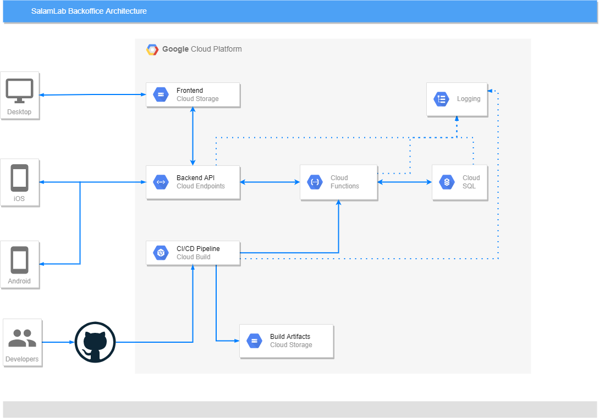

# About this document

This document outlines the scope and required functionality for the _KOK:on_ project.

# Summary

In the wake of the Russian invasion of Ukraine, hundreds of thousands of people migrated to Poland. They have various needs, and one of them is a temporary place to live. The project is inteded to support backoffice processes of SalamLab's Crisis Point at Radziwiłłowska 3, Kraków.

Today, members and volunteers at Crisis Point manage the database in a Google Spreadsheet. The data is encrypted at rest, and only people with volunteering contract have access to sensitive PII information, but with scaling of the organization and increasing number of people working concurrently on the database, they are starting to see drawback in this approach.

To better streamline volunteers' workflow the need is for dedicated software that optimizes flow and display of information, and enforce validation rules for people offering help, before they're connected with people in need. This need would also benefit the workflow of other organizations managing crisis situations.

## Glossary of terms

**Host** — a person who offers accommodation for people in need.

**Guest** — a person who uses the accommodation provided by the Host.

**Team Member** — verified member of organization with escalated privileges that manages the process of connecting *Host* with *Guest* and ensures that all safety protocols are observed.

**Accommodation Unit** — a house/apartment/room owned by the *Host* and made available to *Guests*

## Use of IETF Keywords

This document employs a subset of the Internet Engineering Task Force keywords found in [RFC 2119](https://datatracker.ietf.org/doc/html/rfc2119). These words are MUST, SHALL, SHOULD, MAY and their counterparts MUST NOT, SHOULD NOT, MAY NOT. They are capitalized throughout the document to draw attention to their special status as keywords used to indicate requirements levels.

Readers are directed to interpret them as requirements at levels consistent with their term of art definitions in the IETF [RFC 2119](https://datatracker.ietf.org/doc/html/rfc2119).

## Assumptions

## Constraints

1. Applicable GDPR laws: https://gdpr-info.eu/

## Dependencies

### Identity verification

The system needs to be able to verify the identity of the *Host*. The project does not aim at providing solution to this problem as there are vendors in the market offering such solutions.

Considered options are:
- Blue Media 1pln money transfer loop, openbanking-based verification, "Selfie"-biometrics verification, Liveness check biometric verification.
- Authologic - banking KYC, 1gr money transfer loop, "Selfie" biometrics, email verification, polish cell number verification, foreign cell number verification, digital id w/ PIN, digital ID w/o PIN.
- Autenti

## Risks

### Business Risks

### Technical Risks

1. No methods of authentication are 100% foolproof. Dedicated agent, can manipulate all above protective measures.

### Impacts

No organizational, training, documentation or process impacts have been identified.

## Technology

### Frontend

- Node.js 14.x
- React

### Backend

- Python 3.9
- Google Cloud Functions Framework

### Database

- PostgreSQL 13

## Architecture

Application MUST be deployed to three separate environments: *Development*, *Staging* and *Production*.

Neither *Development* nor *Staging* environment MUST NOT include PII data. It SHOULD include synthetic data for realism and validation purposes.

The application interfaces with the following applications/systems:

1. **GitHub** - Application's Continuous Integration/Continuous Deployment process observes GitHub master branch, and development branch

## Security

1. GCP Secrets Manager service MUST be used to secure the User ID/passwords (Database, etc.). The credentials MUST be retrieved during startup but cached in RAM to avoid repeated dip into the Secrets Manager.
2. There MUST be RBAC (Role Based Access Controls) to Cloud SQL.
3. Cloud SQL MUST have internal IP address only. Connections to Cloud SQL MUST be done via *Bastion Host*.
4. There MUST be strong RBAC around Secrets.
5. There MUST be data encryption at rest in Cloud SQL for any sensitive information in *Production* environment.

## API

1. Backend MUST expose dedicated REST API for the frontend.
2. Backed MAY expose REST API for authenticated 3rd party users.
3. REST API MUST be defined using Swagger 2.0 specification. Version 2.0 is the highest OpenAPI version supported by [Cloud Endpoints](https://cloud.google.com/endpoints/docs/openapi)
4. REST API OpenAPI definition must be available in root folder of [backend's git repository](https://github.com/KoalicjaOtwartyKrakow/backend/blob/main/api.yaml)

## Scenarios

The system needs to support the following scenarios:

### As a Guest

In the beta version, there are no Guest scenarios.

### As a Volunteer

#### I want to list all Guests

1. System MUST be able to list all *Guests*
2. System SHALL use summary information view when listing all *Guests*
3. System MUST allow user to see detailed view of selected *Guest* with all information.
4. System SHALL show *Full Name* in summary view
5. System SHALL show *Desired Location* in summary view
6. System SHALL show *Priority Status* in summary view
7. System SHALL show *Priority Date* in summary view
8. System SHALL show *Verification Status* in summary view
9. System SHALL show "Food Allergies" in summary view
10. System SHALL show "Meat-free diet" in summary view
11. System SHALL show "Gluten-free diet" in summary view
12. System SHALL show "Lactose-free diet" in summary view
13. If not specified otherwise, System SHALL by default return the list of *Guests* sorted by *Verification Status*, *Priority Status*, and *Priority Date*
14. If not specified otherwise, System SHALL use following order while sorting by *Verification Status*: Verified, Created, and Rejected.
15. If not specified otherwise, System SHALL use following order while sorting by *Priority Status*: in_crisis_point, in_krakow, en_route_poland, en_route_ukraine, accommodation_found, accommodation_not_needed 
16. If not specified otherwise, System SHALL use ascending order while sorting by *Priority Date*.
17. Backend SHOULD provide synthetic *Priority* property calculated based on sorting requirements.
18. System MUST be able to filter *Guests* by *Verification Status*.
19. System MUST be able to filter *Guests* by *Desired Location*.
20. System MUST be able to filter *Guests* by *Priority Status*.
21. System MUST be able to filter *Guests* by *Full Name*

#### I want to list all Accommodation Units

1. System MUST be able to list all *Accommodation Units*
2. System SHALL use summary information view when listing all *Accommodation Units*
3. System MUST allow user to see detailed view of selected *Accommodation Unit* with all information.
4. System SHALL show *City* in summary view
5. System SHALL show *Full Address* in summary view
6. System SHALL show *LGBT Friendly* property in summary view
7. System SHALL show *Does Accept Pets* property in summary view
8. System SHALL show "Easy Ambulance Access" property in summary view
9. System SHALL show "Parking Place Available" property in summary view
10. System SHALL show "Disabled People Friendly" property in summary view
11. System SHALL show "Verification Status" is summary view
12. System SHALL show *Occupancy Status* as both *Vacancies Taken* and *Vacancies Free*
13. System SHALL use color coding to visually highlight *Occupancy Status*.
14. System SHALL use green color code for *Accommodation Unit* with all vacancies free.
15. System SHALL use red color code for *Accommodation Unit* with no vacancies left.
16. System MAY use yellow color code for *Accommodation Unit* with less than half vacancies left.
17. If not specified otherwise, System SHALL by default return the list of *Accommodation Units* sorted by *Verification Status* and *Vacancies Free*. 
18. If not specified otherwise, System SHALL use following order while sorting by *Verification Status*:  Verified, Created, and Rejected.
19. If not specified otherwise, System SHALL use descending order while sorting by *Vacancies Free*
20. Backend SHOULD provide synthetic *Priority* property calculated based on sorting requirements.
21. System MUST be able to filter *Accommodation Units* by *Verification Status*.
22. System MUST be able to filter *Accommodation Units* by *City*.
23. System MUST be able to filter *Accommodation Units* by *Occupancy Status*. Free, Partially occupied, Fully occupied.

#### I want to find an Accommodation Unit matching Guests' needs

1. System MUST be able to list *Accommodation Units* matching *Guest*'s needs
2. System SHALL mark *Accommodation Units* as matching if *Vacancies Free* property is greater or equal than *People in Group* property of *Guest*.

#### I want to assign Accommodation Unit to Guest

1. System MUST be able to assign *Guest* to *Accommodation Unit*
2. System MUST NOT assign *Guest* to *Accommodation Unit* if *Vacancies Free* property of *Accommodation Unit* is less than *People in Group* property of *Guest*
3. On successful assignment System SHALL adjust *Vacancies Free* property of *Accommodation Unit*
4. On successful assignment System SHALL set *Guest*'s *Priority Status* to *accommodation_found*.

### As a Host (Priority: 2)

In the beta version there are no Host scenarios.

### As a System Administrator

#### I want to be able to import data from external sources

1. System MUST provide interface for uploading CSV files
2. System MUST convert data found in Salam Lab's legacy database in Google Spreadsheet into current system's data model.
3. System MUST be able to correlate data from import with existing data
4. System MUST be able to identify and reject duplicate entries
5. System MUST report the entries rejected during import