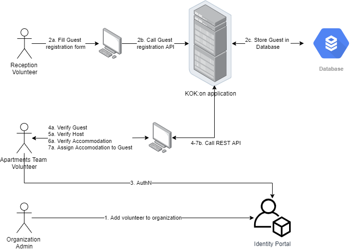
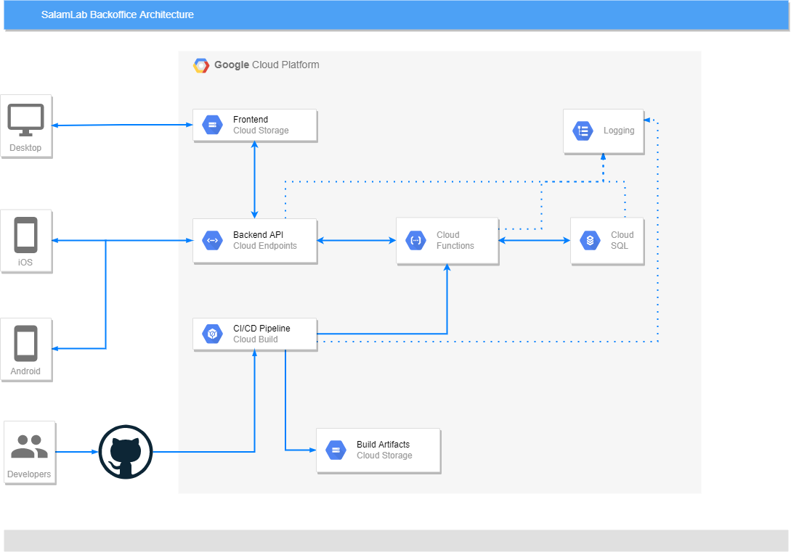

- Start Date: 2022-03-01
- RFC PR: None
- KOK:on Issue: None

# Summary

This is an RFC to create a basic CRUD system for *Guests*, *Hosts* and *Accommodation Units* to replace Radziwiłłowska 3 google spreadsheets.

# Motivation

Current implementation done in Google Spreadsheets, while was good at the very begining, and allowed organizations to take off the ground, and start helping people, suffers from following issues:

- Initial spreadsheets lacked RBAC and control over re-sharing
- Google Spreadsheets apparently have a limit of 200 shares. When documents reaches the limit, it cannot be shared with no new person.
- The way ingesting data from Google Forms was set up, quickly led to data integrity issues.

Today, members and volunteers at Crisis Point manage the database in a Google Spreadsheet. The data is encrypted at rest, and only people with volunteering contract have access to sensitive PII information, but with scaling of the organization and increasing number of people working concurrently on the database, they are starting to see drawback in this approach.

To better streamline volunteers' workflow the need is for dedicated software that optimizes flow and display of information, and enforce validation rules for people offering help, before they're connected with people in need. This need would also benefit the workflow of other organizations managing crisis situations.

# Detailed Design

## Use of IETF Keywords

This document employs a subset of the Internet Engineering Task Force keywords found in [RFC 2119](https://datatracker.ietf.org/doc/html/rfc2119). These words are MUST, SHALL, SHOULD, MAY and their counterparts MUST NOT, SHOULD NOT, MAY NOT. They are capitalized throughout the document to draw attention to their special status as keywords used to indicate requirements levels.

Readers are directed to interpret them as requirements at levels consistent with their term of art definitions in the IETF [RFC 2119](https://datatracker.ietf.org/doc/html/rfc2119).

## Business Architecture

### Capabilities

Provide backoffice functionality for Radziwiłłowska 3 Crisis Point.

### Assumptions

1. System is not going to enforce strict validation rule for information stored, except for Personally Identifiable Information of both *Guest* and *Host* required to ensure safety of all parties.

### Constraints

1. Applicable GDPR laws: https://gdpr-info.eu/

### Dependencies

None.

## Risks

### Business Risks
1. Having large amount of PII data available to indivituals could lead to data leakage/loss. To mitigate this, access to backoffice system SHOULD be periodically audited by organization. To support this, backoffice system SHALL not introduce own AuthN user database, but SHALL use external directories managed by the organization.

### Technical Risks

None.

### Impacts

1. Team Members will need to be trained with the new workflow and procedures.

## Data Architecture

1. All operational data SHALL be stored in Cloud SQL database
2. All reporting data MAY be stored in Cloud SQL or Cloud Storage at discretion of DevOps team
3. `Guests` table SHALL be created with at least following fields:
    - `guid` which is a UUIDv4 compatibile Primary Key
    - `full_name` which is a string
    - `email` which is a string
    - `phone_number` which is a string. Phone number SHOULD include prefix code.
    - `is_agent` which is a boolean. Agent is an acting proxy for bigger group of people.
    - `document_number` which is a string. Based on identity validation rules (§11 and §12, [Act on assistance to Ukrainian citizens in connection with an armed conflict in the territory of that state, Dz.U. 2022 poz. 583](https://dziennikustaw.gov.pl/DU/2022/583)) valid documents are (including expired and/or invalidated): passpord, ID card, Pole's Card, driving license, or any document with a photo, including birth certificate for persons under 18 years old. 
    - `people_in_group` which is a number signifying total number of people, including audults and children.
    - `adult_male_count` which is a number
    - `adult_female_count` which is a number
    - `children_ages` which is an array of numbers signifying age of each child in a group.
    - `have_pets` which is a boolean. Field SHALL be true if animals are accompanying a group.
    - `pets_description` which is a text field, for description of accompaniying animals.
    - `special_needs` which is a text field, for any special needs any person in a group might have.
    - `food_allergies` which is a text field, for any allergies any person in a group might have.
    - `meat_free_diet` which is a boolean
    - `gluten_free_diet` which is a boolean
    - `lactose_free_diet` which is a boolean
    - `finance_status` which is a text field, for specyfing if a group can afford paying any rent
    - `how_long_to_stay` which is a string. Field SHALL be in format of `\d+(d|w|m|y)` where `d` signifies a *day*, `w` a *week*, `m` a *month*, and `y` a *year*. In case of uncertainty, an upper bound SHOULD be specified - i.e. if a *Guest* wants to stay between 1 or 2 weeks, the field SHALL be `2w`.
    - `desired_destination` which is a text field. It contains information if Kraków is a target desitnation for *Guest*.
    - `priority_status` which is an enumeration of:
        - DOES_NOT_RESPOND - *Team Members* could not contact a *Guest*
        - ~~ACCOMMODATION_NOT_NEEDED - *Guest* does not require accommodation.~~ This is a deprecated value.
        - EN_ROUTE_UA - *Guest* is in transit, still in Ukraine
        - EN_ROUTE_PL - *Guest* is in transit, and crossed the border.
        - IN_KRK - *Guest* is in Kraków
        - AT_R3 - *Guest* is in Crisis Point on Radziwiłłowska 3.
        - ACCOMMODATION_FOUND - *Guest* was successfuly matched with an *Accommodation Unit*
        - ~~UPDATED - *Guest* information was updated. Attention needed.~~ This is deprecated value.
    - `priority_date` which is a timestamp, signifying a date since the accommodation is needed
    - `staff_comments` which is a text field, for comments of *Team Members*
    - `verification_status` which is an enum:
        - CREATED - verification process was not finished
        - VERIFIED - verification was successful
        - REJECTED - verification failed
    - `system_comments` which is a text field, for any automated import and/or validation comments
    - `created_at` which is a timestamp
    - `updated_at` which is a timestamp
    - `accommodation_unit_id` which is a UUIDv4 compatibile GUID, a foreign key to `AccommodationUnits` table
4. `Languages` table SHALL be created with at least following fields:
    - `name` which is a string, a language name in its native form, i.e. *Polski*, *Deutsch*, *Українська*
    - `code2` which is a 2 character string, representing ISO 639-1 code.
    - `code3` which is a 3 character string, representing ISO 639-2 code.
4. `Hosts` table SHALL be created with at least following fields:
    - `guid` which is a UUIDv4 compatibile Primary Key
    - `full_name` which is a string
    - `email` which is a string
    - `phone_number` which is a string. Phone number SHOULD include prefix code.
    - `call_after` which is a string
    - `call_before` which is a string
    - `comments` which is a text field, for additional information from the *Host*
    - `status` which is an enum:
        - CREATED - verification process was not finished
        - VERIFIED - verification was successful
        - REJECTED - verification failed
    - `created_at` which is a timestamp
    - `updated_at` which is a timestamp
    - `system_comments` which is a text field, for any automated import and/or validation comments
4. `HostLanguages` table SHALL be created with at least following fields:
    - `language_code` which is a ISO 639-1 2 character code, foreign key into `Languages` table.
    - `host_id` which is a UUIDv4 compatibile GUID, foreign key into `Host` table.
4. `AccommodationUnits` table SHALL be created with at least following fields:
    - `guid` which is a UUIDv4 compatibile Primary Key
    - `host_id` which is an UUIDv4 compatibile Foreign Key into `Hosts` table
    - `city` which is a string
    - `zip` which is a string, for postal code
    - `voivodeship` which is an enum:
        - DOLNOSLASKIE
        - KUJAWSKOPOMORSKIE 
        - LUBELSKIE
        - LUBUSKIE
        - LODZKIE
        - MALOPOLSKIE
        - MAZOWIECKIE
        - OPOLSKIE
        - PODKARPACKIE
        - PODLASKIE
        - POMORSKIE
        - SLASKIE
        - SWIETOKRZYSKIE
        - WARMINSKOMAZURSKIE
        - WIELKOPOLSKIE
        - ZACHODNIOPOMORSKIE
    - `address_line` which is a string, including street name, street and apartment number
    - `vacancies_total` which is a number
    - `pets_present` which is a boolean. True SHALL indicate animals in apartment.
    - `pets_accepted` which is a boolean. True SHALL indicate that animals are welcome in apartment.
    - `disabled_people_friendly` which is a boolean. True SHALL indicate that apartment can be accessed and used by people with disabilities
    - `lgbt_friendly` which is a boolean. True SHALL indicate that apartment is safe space for LGBT+ people
    - `parking_place_available` which is a boolean. True SHALL indicate that *Guests* can come by car and will have a place to park it.
    - `owner_comments` which is a text field, for *Host* comments.
    - `easy_ambulance_access` which is a boolean. True SHALL indicate that appartment can be used by paliative care *Guests*, and people that do not necessarily require hospitalization, but their health condition may require immediate transport to the hospital.
    - `vacancies_free` which is a number
    - `staff_comments` which is a text field, for comments of *Team Members*
    - `status` which is an enum:
        - CREATED - verification process was not finished
        - VERIFIED - verification was successful
        - REJECTED - verification failed
    - `created_at` which is a timestamp
    - `updated_at` which is a timestamp
    - `system_comments` which is a text field, for any automated import and/or validation comments
5. Data tables MAY include additional fields if needed by internals of the Services.

## Application Architecture

### Conceptual Diagram

Description of steps:
1. Organization admin adds user to User Directory
2. Reception volunteer navigates to Guest Registration Form
   * a/ Web-based form is served
   * b/ When form is submitted, a REST API is called
   * c/ Data is stored in the database
3. Apartment Team Volunteer navigates to the Admin Panel
   * a/ Admin Panel forces user to authenticate with their organization
4. Volunteer verifies the data of *Guest* using Guest Module of Admin Panel
5. Volunteer verifies the data of *Accommodation* using Accommodation Module of Admin Panel
6. Volunteer verifies the data of *Host* using Host Module of Admin Panel
7. Volunteer navigates to *Guest* details, searches for the matching appartment and assigns it to the *Guest*

### Scenarios

The system needs to support the following scenarios:

#### As a Guest

In the beta version, there are no Guest scenarios.

#### As a Team Member

##### ... I want to access Admin Panel

Admin Panel's landing page SHALL provide means to navigate to three availalbe modules: *Guest*, *Host* and *Accommodation*. Selecting *Guest* module SHALL open a *Guest* listing page providing summary of all *Guests* in the system. Similarly, selecting *Host* or *Accommodation* modules SHALL open listing page of *Hosts* and *Accommodations* respectively.

##### ... I want to list all Guests

*Guests* listing page SHALL provide description of icon status indicators:
   - Meat-free diet - does *Guest* require meat-free diet
   - Food allergies - does *Guest* have any food allergies
   - Gluten-free diet - does *Guest* require gluten-free diet
   - Lactose-free diet - does *Guest* require lactose-free diet

*Guests* listing page SHALL provide summary information of all *Guests* in the system in a tabular form, including columns:
   - Full name - First Name and Last Name of the *Guest*.
   - Phone number - Including international and local prefixes
   - Status - Priority status of a Guest. This can be one of the following:
     * Does not respond - after initial registration, volunteers were unable to contact the *Guest*
     * Accommodation not needed - legacy, deprecated value, *Guest* were registered for another reason. Can be found in imported data.
     * En route in Ukraine - *Guest* is traveling, still in Ukraine
     * En route in Poland - *Guest* successfully crossed the border, and is traveling to Kraków
     * In Kraków - *Guest* is here
     * At Radziwiłłowska 3 - *Guest* is in Crisis Response Center. Immediate attention required.
     * Accommodation Found - *Guest* is fine for now. This can change tho.
     * Updated - legacy, deprecated value, can be found in imported data.
   - Priority - when accommodation is required
   - How many - How many people are in the group. This should be split into Total, Men, Women, and Children count.
   - How long - for how long a stay is required. Row order of magnitude.
   - Remarks - The field SHALL include both icons representing *Food Allergies*, *Meat-free diet*, *Gluten-free diet*, *Lactose-free diet* as well as free-form notes from the *Guest*.

If not specified otherwise, System SHALL by default return the list of *Guests* sorted by *Priority Status*, and *Priority Date*. If not specified otherwise, System SHALL use following order while sorting by *Priority Status*:
   - At Radziwiłłowska 3
   - Updated
   - In Kraków
   - En route in Poland
   - En route in Kraków
   - Does not respond
   - Accommodation Found
   - Accommodation Not Needed 
If not specified otherwise, System SHALL use ascending order while sorting by *Priority Date*. 

Upon selecting a row, a Guest Details screen MUST be shown.

##### ... I want to see Guest Details

System MUST allow user to see detailed view of selected *Guest* with all information. The information SHOULD be broken down in logical groups:
- Personal data:
  * Priority Status
  * Full Name
  * E-mail
  * Phone
- Stay Information:
  * Priority Date
  * Stay duration
  * Desired destination
- Number of people
  * Total number of people in the group
  * The number of men
  * The number of women
  * The number of children, with the age for each child.
- Additional information
  * Information if *Guest* has pets
  * Detailed free-form detailed information on pets
  * Financial status - if *Guest* can afford to pay any rent, and if so - how much
  * Document number - number of the Passport, Id, Birth Certificate - any document they used to cross the border
  * Information if *Guest* is an agent - in data coming from Reception Desk at Radziwiłłowska 3, each person is registered as separate *Guest*, and an *Agent* is a person that acts as a proxy for a group of individually registered people.
- Detailed information
  * Special needs
  * Dietary information - information about *Meet-free*, *Gluten-free* and/or *Lactose-free* diet
  * Food allergies - free-form text description of any other restrictions and allergies a *Guest* has

Detailed *Guest* view SHALL include Accommodation Assignment information.

##### I want to assign Guest to Accommodation Unit

*Guest* detail view shall provide means to search for available *Accommodation Units*. If *Accommodation Unit* is assigned to a *Guest* and Team Member attempts to search for other *Accommodation Units* an Application SHALL warn the Team Member that current *Accommodation Unit* MAY be removed.

When presenting the Team Member with *Accommodation Units* matching search criteria, the Application SHALL show:
- Full Address - including Street name, Building and Apartment numbers where applicable, Zip code, City and Voivodeship name
- *Host* contact details including:
    * Full Name
    * Email
    * Phone number
    * Preferred hours to contact
- Verification status
- Accommodation's vacancy information

When presenting list of *Accommodation Units* matching search criteria for the *Guest* the Application SHALL sort the results by:
- Verification Status - in order of Verified, Verification Pending, Rejected
- Vacancies Free

### User Interface

User Interface SHOULD be branded with logos of organizations involved in operating and developing the system:
- [Laboratorium Pokoju - Salam Lab](http://salamlab.pl)
- [UA in Kraków - Fundacja Instytut Polska-Ukraina](http://uainkrakow.pl)
- [Fundacja Zustricz](http://zustricz.pl)
- [Koalicja Otwarty Kraków](http://koalicjaotwartykrakow.pl)

### Services

#### API

Services MUST expose dedicated REST API for the User Interface. They MAY expose REST API for authenticated 3rd party users. All REST API endpoints MUST be defined using Swagger 2.0 specification. Version 2.0 is the highest OpenAPI version supported by [Cloud Endpoints](https://cloud.google.com/endpoints/docs/openapi)

### Deployment Diagram

The application interfaces with the following applications/systems:

1. **GitHub** - Application's Continuous Integration/Continuous Deployment process observes GitHub master branch, and development branch

### Availability

The system SHOULD have availability of 95%.

### Security

GCP Secrets Manager service MUST be used to secure the User ID/passwords (Database, etc.). The credentials MUST be retrieved during startup but cached in RAM to avoid repeated dip into the Secrets Manager. There MUST be RBAC (Role Based Access Controls) to Cloud SQL, and very strong RBAC around Secrets. Cloud SQL MUST have internal IP address only. Connections to Cloud SQL MUST be done via *Cloud Proxy* for increased security and session timeouts. There MUST be data encryption at rest in Cloud SQL for any sensitive information in *Production* environment.

## Infrastructure Architecture

### Separation of Environments

1. Application MUST be deployed to three separate environments: *Development*, *Staging* and *Production*.
   2, Neither *Development* nor *Staging* environment MUST NOT include PII data. It SHOULD include synthetic data for realism and validation purposes.
2. Application components that handle PII data MUST be deployed in EU
3. External system which exchange PII data with Application must be configurable with EU region for data storage.
